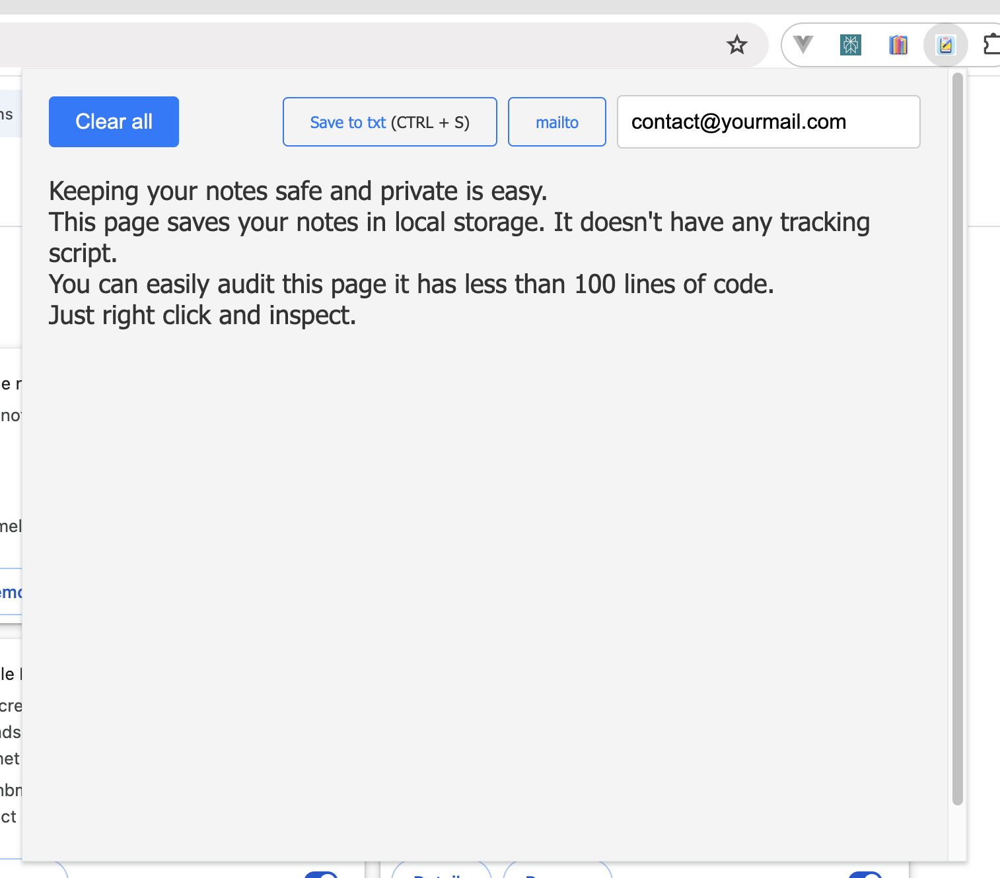

# Offline Notes Chrome Extension

This is a simple Chrome extension that allows you to take notes offline.

Your notes are saved in your browser's local storage, ensuring they remain private and secure.

It's not pretty but it works.

## Features

- Save notes offline in your browser
- Email notes to yourself
- Download notes as a text file
- Clear all notes and email after confirming

## Screenshots

## Privacy

There is no bullshit you can look it up yourself because it's less than 100 lines of code.

## Installation

1. Clone this repository to your local machine.
2. Open Chrome and navigate to `chrome://extensions`.
3. Enable Developer mode by clicking the toggle switch at the top right.
4. Click the `Load unpacked` button and select the extension directory.

## Usage

1. Open the extension by clicking on its icon in the Chrome toolbar.
2. Start typing your notes in the text area.
3. Your notes are automatically saved in your browser's local storage.
4. To email the notes to yourself, edit the email and click on the "mailto" button. This will open your default email client with a new email containing your notes.
5. To download your notes as a text file, click on the "Download" button.
6. To clear all notes and email, click on the "Clear All" button. This will ask you ton confirm before clearing all your notes and the email from your local storage.

## Permissions

This extension requires no permissions.

## Contributing

Just fork it I don't want to maintain this.

## License

[MIT](https://choosealicense.com/licenses/mit/)
